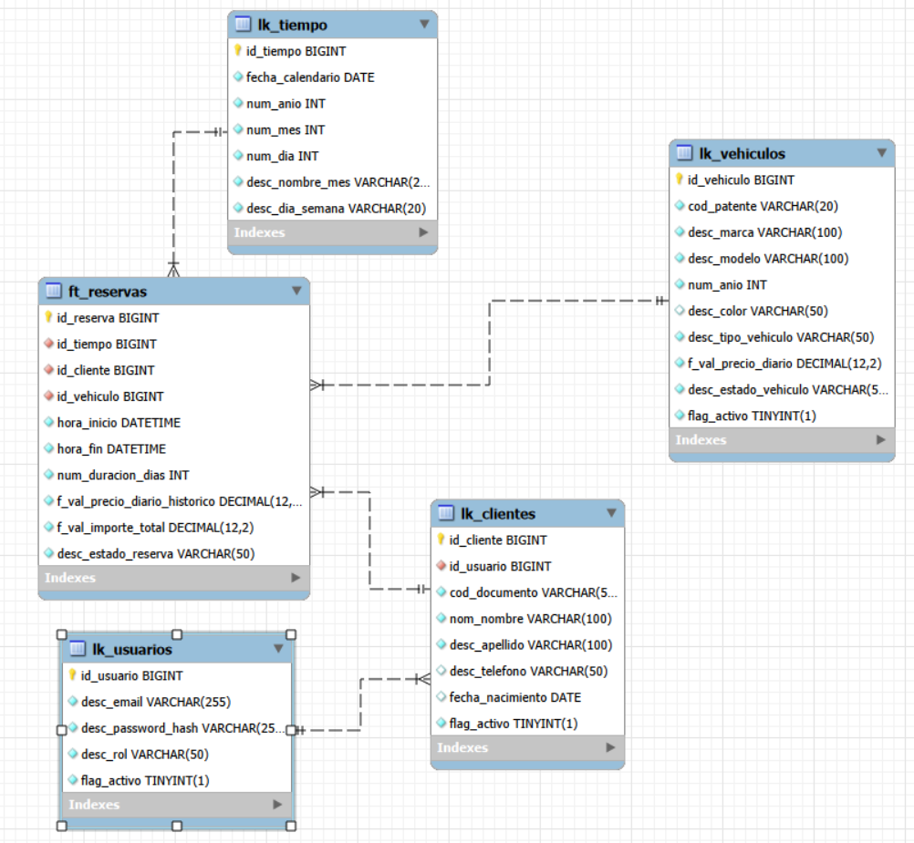

# Rentar

Sistema web para la gestión de alquiler de vehículos, desarrollado como Trabajo Práctico de la materia.

## Descripción

**Rentar** es una aplicación destinada a gestionar el alquiler de vehículos, permitiendo administrar vehículos y clientes, consultar disponibilidad, registrar y gestionar reservas y consultar el historial de alquileres.

El proyecto cuenta con un backend desarrollado con Spring Boot, que expone funcionalidades mediante APIs REST y GraphQL, y un frontend desarrollado con React, TypeScript y Vite, que proporciona la interfaz de usuario para interactuar con la aplicación.

## Tecnologías

- Java
- Spring Boot
- Spring Data JPA
- MySQL
- Lombok
- Swagger / OpenAPI
- REST
- GraphQL
- React 19
- TypeScript
- Vite
- Node.js 22
- npm

## Funcionalidades

El Trabajo Práctico contempla las siguientes funcionalidades:

| # | Funcionalidad | Tecnología |
|---|---|---|
| 1 | Gestión de vehículos | REST |
| 2 | Consulta de disponibilidad | GraphQL |
| 3 | Gestión de clientes | REST |
| 4 | Alta de reserva | REST |
| 5 | Consulta de reservas | GraphQL |
| 6 | Cancelación de reserva | REST |
| 7 | Historial de alquileres | GraphQL |

## Documentación de la API

La API REST se documenta mediante **Swagger / OpenAPI**.

Desde Swagger se pueden consultar y ejecutar los endpoints disponibles, incluyendo los parámetros y cuerpos de las solicitudes.

Con la aplicación ejecutándose, acceder a:

http://localhost:8080/swagger-ui/index.html

## Estructura del proyecto

La aplicación sigue una estructura separada por responsabilidades:

```text
src/
└── main/
    └── java/
        └── com.grupo_d_c2_2026_unla.rentar/
            ├── controller/
            ├── dto/
            ├── entity/
            ├── repository/
            ├── service/
            │   └── implementation/
            ├── enums/
            └── ...
```

### Capas principales

- **Controller:** recibe las solicitudes HTTP y expone los endpoints.
- **Service:** contiene la lógica de negocio.
- **Repository:** acceso a la base de datos mediante Spring Data JPA.
- **Entity:** representa las tablas de la base de datos.
- **DTO:** objetos utilizados para recibir y devolver información mediante las APIs.

## Base de datos

El sistema utiliza **MySQL** como motor de base de datos.

### Modelo


## Requisitos previos

- **Java 21** instalado.
- **MySQL Server** instalado y ejecutándose localmente en el puerto 3306.
- **Node 22** y **npm** instalado.
- Base de datos **`rentar`** creada mediante el script `Proyecto/BD/rentarBD.sql`.
- Configurar las credenciales de MySQL en el proyecto.

## Ejecución del proyecto

Una vez cumplidos los requisitos previos:

## Ejecución del proyecto

Una vez cumplidos los requisitos previos:

1. **Clonar o descargar el repositorio.**

2. **Crear la base de datos MySQL** ejecutando el script ubicado en:

   ```text
   Proyecto/BD/rentarBD.sql
   ```

3. **Configurar la conexión a MySQL** en el backend según el entorno local.

4. **Ejecutar el backend.**

   Ejecutar:

   ```bash
   ./mvnw spring-boot:run
   ```

   En Windows también puede utilizarse:

   ```bash
   mvnw.cmd spring-boot:run
   ```

   El backend quedará disponible en:

   ```text
   http://localhost:8080
   ```

5. **Probar los endpoints REST** desde Swagger una vez iniciado el backend.

   ```text
   http://localhost:8080/swagger-ui/index.html
   ```

6. **Acceder a GraphiQL** para ejecutar las consultas GraphQL:

   ```text
   http://localhost:8080/graphiql
   ```

7. **Ejecutar el frontend.**

   Desde el directorio:

   ```text
   frontend/
   ```

   instalar las dependencias:

   ```bash
   npm install
   ```

   y luego iniciar el servidor de desarrollo:

   ```bash
   npm run dev
   ```

   El frontend estará disponible en:

   ```text
   http://localhost:5173
   ```


## Equipo

**Grupo D - C2 - 2026 - UNLa**

Trabajo Práctico — Sistema de alquiler de vehículos **Rentar**.
